# Lab 1: Installing SDR Receivers
(Adapted from Dr. John Pauly's Stanford University EE179 course website: https://web.stanford.edu/class/ee179/Homework.html.)

## Overview

The USB dongles you will receive in class can directly digitize a 3.2 MHz segment of the RF spectrum, from 27 MHz up to 1.7 GHz. This can capture a large part of the RF spectrum, which we can then process in MATLAB or Python and extract the signals we want.

In this lab we will install the SDR software for your computer and then use a real time spectral display to look at some of the different signals that are all around you.

## Aims of the Lab

This lab is aimed getting your software working and starting to look around at all of the signals that you are constantly being bombarded with. The main requirement of the lab is to take a screen shot of your spectrum visualization display showing some interesting narrowband FM signal, describe what you think you are seeing, save the screenshot and description as a PDF file, and submit it to Gradescope.

This will show you have gotten everything going! Find an interesting frequency, and try to identify what is happening there. Next week there will be more to do.

## Software Installation

There are two parts to the software you need. The first is the device driver to control the SDR. The second is the spectrum visualization software. 

### Device Driver

Follow these steps to install the drivers necessary to run the dongle as an SDR (adapted from https://www.rtl-SDR.com/rtl-SDR-quick-start-guide/):
- Download Zadig from Teams (General->Files). You can also find it at https://zadig.akeo.ie/downloads
- Connect an antenna to your RTL-SDR dongle and plug it into a USB port. Wait a few seconds to make sure it doesn't try to automatically install any software (it shouldn't)
- Go to the folder where you downloaded Zadig and double click to open (or right click and select "Run as administrator")
- Go to "Help->Update Policy and Settings" then "Check Now" then "Close"
- Go to "Options->List All Devices"

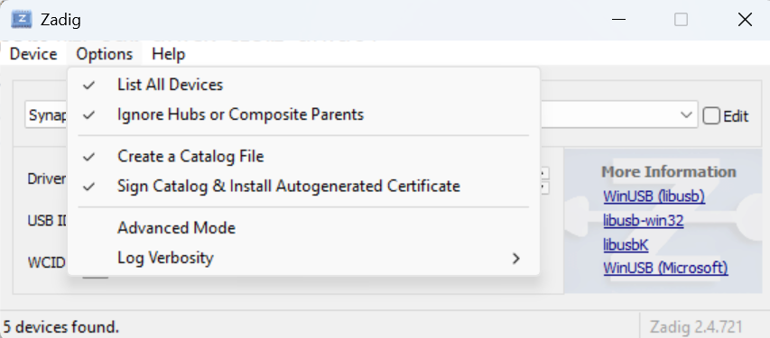

- **WARNING: follow the next few instructions closely! Do NOT select anything besides what is instructed, or you will likely overwrite a driver for your mouse, keyboard, etc.** 
    - Open the top drop-down menu. Select "Bulk-In, Interface (Interface 0)". Make sure it is Interface o (ZERO) and not "1". You may see "RTL2838UHIDIR" instead of the bulk in interface. This is also a valid selection. 

    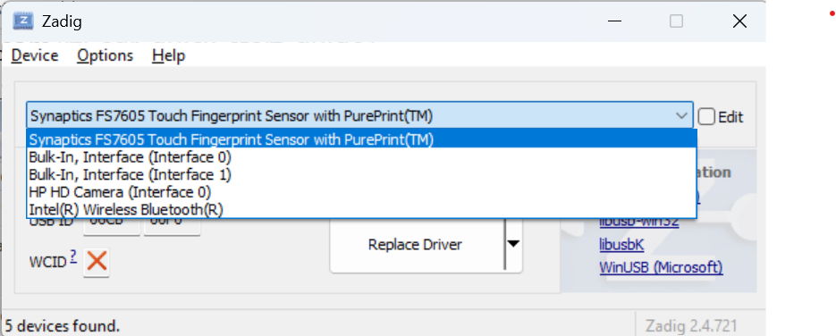
    
    - Verify the Driver shows WinUSB on the right of the green arrow. The right hand box shows the currently installed driver, and left hand box shows the driver that will be installed. It doesn't matter what the right hand box shows, but it will likely be (NONE) or (RTL...).
    - Verify the USB ID is "0BDA 2838 00", which means the dongle is selected.

    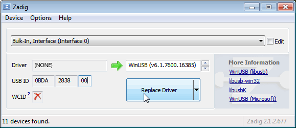
    
    - Click on Reinstall Driver. You may get a warning, but just accept it. Wait a few minutes for the installation. 
- Check Device Manager for any caution triangles (Windows + X, M).
- Delete the Zadig executable file when complete.

In case you were wondering, "Bulk-In, Interface 0" and "Bulk-In, Interface 1" refer to USB interfaces exposed by the SDR dongle, not the physical USB ports on your computer. "Bulk-In, Interface 0" is the primary data interface used by the SDR for streaming radio signals to your computer and is the one you want to isntall the WinUSB driver on when you were using Zadig. "Bulk-In, Interface 1" is typically a secondary interface used for other functions (remote control, audio), but it's not used for SDR signal processing. Installing the driver on this interface can cause issues like device connection errors.

### Spectrum Visualization Software Installation

Now we will download radioconda. Radioconda is a specialized software distribution built on the conda package manager, designed specifically for SDR applications. It includes GNU Radio, Digital RF, gqrx, and support for several types of SDRs, including the RTL-SDR you received.

Follow these steps:
- Go to https://github.com/ryanvolz/radioconda/releases and download the newest executable release for your operating system. I use Windows, so I downloaded "radioconda-2025.03.14-Windows-x86_64.exe".
- Open the folder where you downloaded radioconda and run the executable file.
- After radioconda is installed, open gqrx. (The easiest way for me to find gqrx is typing 'gqrx' into the WIndows search bar.)

We will use the gqrx program as our spectrum visualization tool. There are several other spectrum visualization tools available (e.g., SDR#, SDR++, HDSDR, SDR Angel for Android, and more), all with varying levels of functionality. gqrx is a graphical interface built on top of GNU radio, an open source software defined radio project. When you downloaded radioconda, you also downloaded GNU radio and several of its libraries, as well as the command line program we will use in the future labs.

The gqrx web page is [http://gqrx.dk](http://gqrx.dk/), if you want to learn more. Next, we'll use gqrx to pick up commercial FM radio.

## Commercial FM Radio

To receive signals with your RTL-SDR, you first need to make sure you connect the antenna. It is good to get in the habit of first connecting the antenna before powering on your SDR. While you likely won't hurt the SDR, it is possible to damage it through electrostatic discharge (ESD) - which is more likely at high altitudes or if you are wearing synthetic materials. If you don't have grounding mats or other procedures in place to mitigate ESD, just be careful. In your future military job if you are dealing with more sensitive electronics, you will have to be trained on proper ESD procedures. You don't want to be the person who bricks the flight controls of a satellite your team has been building...

If you haven't already done it, connect the antenna and plug the SDR into a USB socket on your computer. Then, start gqrx. When you start gqrx, it will pop up a window for the device configuration. In the Device drop down menu, select "Generic RTL..." 

The RTL-SDR's max sample rate is technically 3.2MHz, but a more stable and reliable rate is 2.4MHz or less, especially with USB 2.0 ports. You just need to ensure the RTL-SDR sample rate is at least double (Nyquist!) the message bandwidth of the signal you want to receive. We'll set the sample rate to 1800000 (i.e., 1.8 MHz). Your computer and the SDR should keep up with this easily. 

Configuration Window

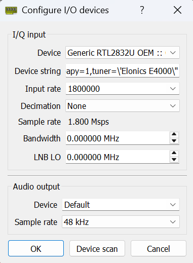  

Click OK, and the gqrx window will pop up:

Initial Display

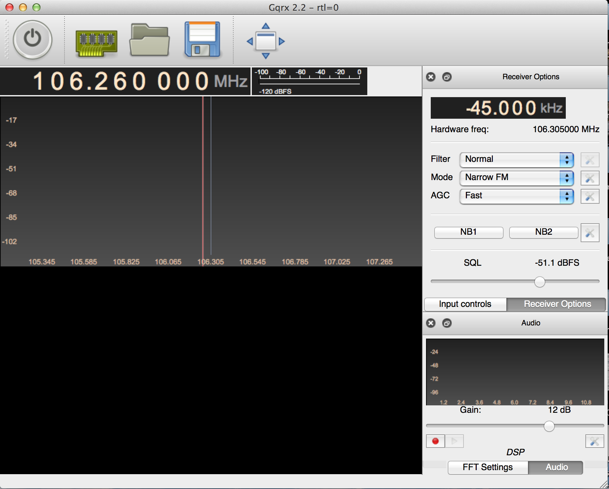  

Set the frequency offset in the upper right to 0.000 kHz, and then set the receiver frequency at the top of the plot to 99.900.000 Hz (or 99.9MHz) by:
- Clicking the numbers at the top of the plot and typing in the frequency you want, or
- Typing the frequency (in kHz) in the Frequency block in the right side menu.

The FM station at this frequency is KVUU, which is one of the strongest signals in the Colorado Springs area and will give you a nice clean signal. Change the “Mode” pulldown in the right side menu to “WFM (stereo)”. The display should look like this:

Tuned to KVUU

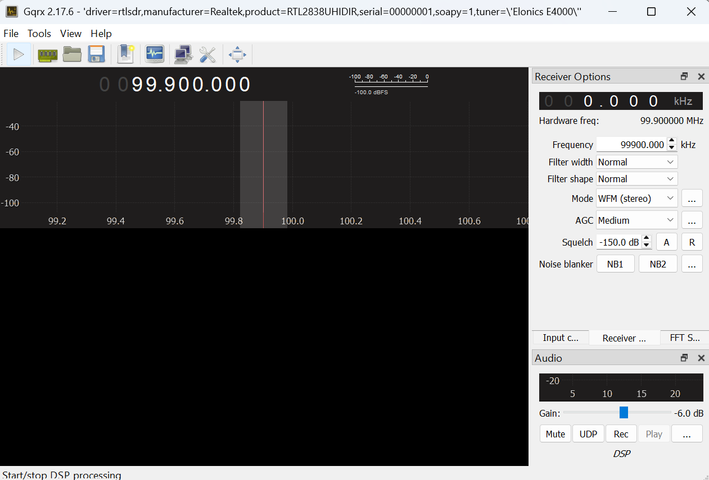  

Now click the play button in the upper left corner. With any luck, you should be listening to KVUU! If you don't hear anything, check that your computer isn't muted and that you are in a location with reception.

Tuned to KVUU

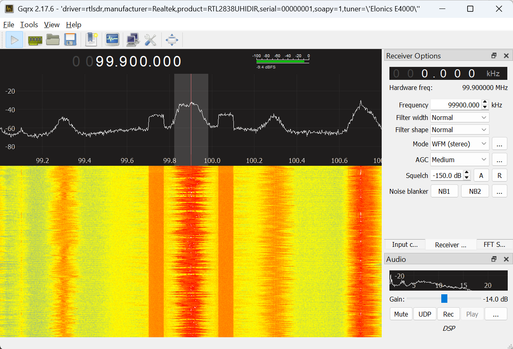  

The plot in the upper panel is the live spectrum being received and has a range +/- 0.9MHz, since you set the sampling rate to 1.8MHz.

The lower panel is a waterfall plot. Each line in the image is the spectrum from the top panel, displayed with color encoding amplitude. It slowly scrolls down as you acquire longer. This plot is a great way to recognize different types of signals.

One useful setting is the receiver gain. To change this click on “Input Controls”, which will bring up a panel for controlling the SDR. There are several sliders available since different types of SDRs have multiple Intermediate Frequency (IF) stages. For the RTL-SDR the primary slider of interest is IF1. Try moving it up and down to see what level gives you the best definition between FM station signals and the noise floor. If it is too low (to the left), the signal will be all noise. If it is too high (to the right) the receiver saturates, and the signal is distorted. The “Hardware AGC” checkbox turns on the hardware automatic gain control. You generally don't want to use it when you are looking for signals, since it will constantly be changing.

Go back to the “Receiver Options”. The top “Filter” pulldown sets how wide a bandwidth we are listening to. This is the shaded region on the live spectrum plot. On “Normal” it chooses something reasonable for whatever modulation we are receiving, so generally leave it there. You can also change the bandwidth by dragging the edge of the shaded region on the spectrum plot. 

The middle “Mode” pulldown selects how the receiver decodes the signal. Common choices are “AM” used for aircraft and air traffic control, “Narrow FM” used for police and fire radio, and “Wide FM” used for commercial FM radio. We will talk about the other options later. The bottom “AGC” pulldown sets how rapidly the receiver adjusts for amplitude variations in the signal. Leave it at "Medium" for now.

Try setting the center frequency to other stations that you may know (such as 92.9 out of Pueblo or 98.1 classic rock). Often you will see several stations in the plot, as shown below, where I increased the sample rate to 3.2MHz and adjusted the gain. At least eight stations are visible.

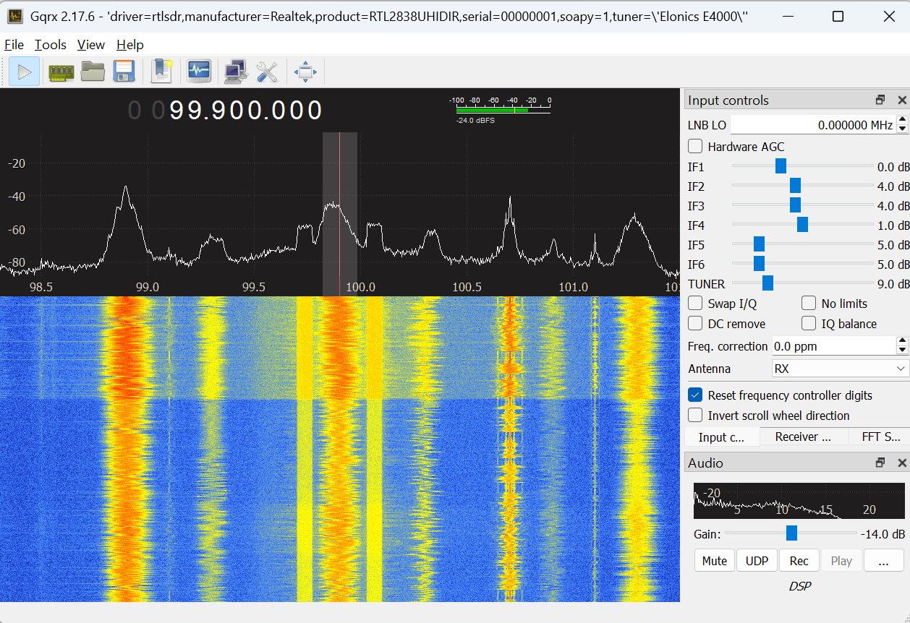  

Select any of them by clicking on them in the top panel. That will set the receiver offset.

We will come back to commercial FM in a couple of labs.

## Police, Fire, and Amateur Radio

There are several frequency bands that are used for public services, such as local police and fire. For Palo Alto, the police, fire, and utilities frequencies are
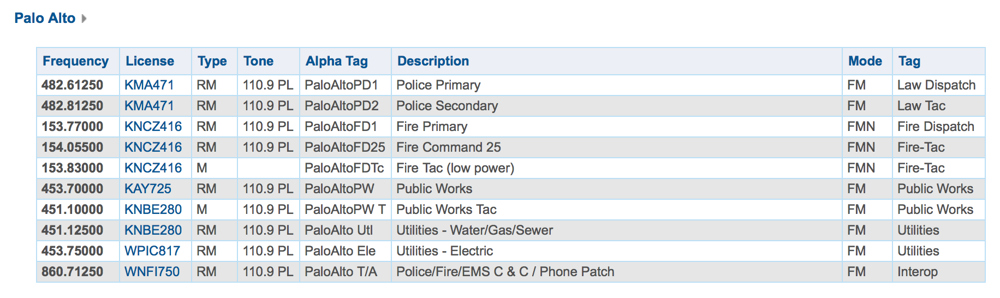
and for the Stanford Police are
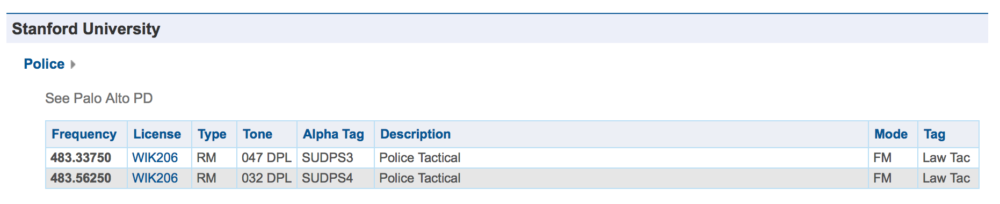
These are from

[http://radioreference.com](http://radioreference.com/)

which is a great source of information on who is transmitting what from where. Both the Palo Alto Police, and the Stanford Police are right around 483 MHz, so set your receiver frequency there. With your 2.4 MHz bandwidth you should see lots of activity, particularly later in the evening.

Note that you may need to find the right environment to be able to see lots of signals. Lots of devices spew RF. Campus buildings, like Packard, have a tremendous amount of interference. Also, buildings can screen signals. You may need to put your antenna in a window, or take your receiver outside, in order to improve your reception.

First, set your receive “Mode” pulldown to “Narrow FM”. This uses much less spectrum than commercial FM, and is commonly used for handheld communications such as police and fire. Click on any of the peaks in the upper plot. That will shift your receiver offset to that frequency. About half of the signals are digital, and will sound like dial-up modems. We'll talk about how these signals are encoded later in the class. The other half will be narrowband FM, and should be easy for you to decode. Your screen should look something like this

### Police and Fire Frequencies

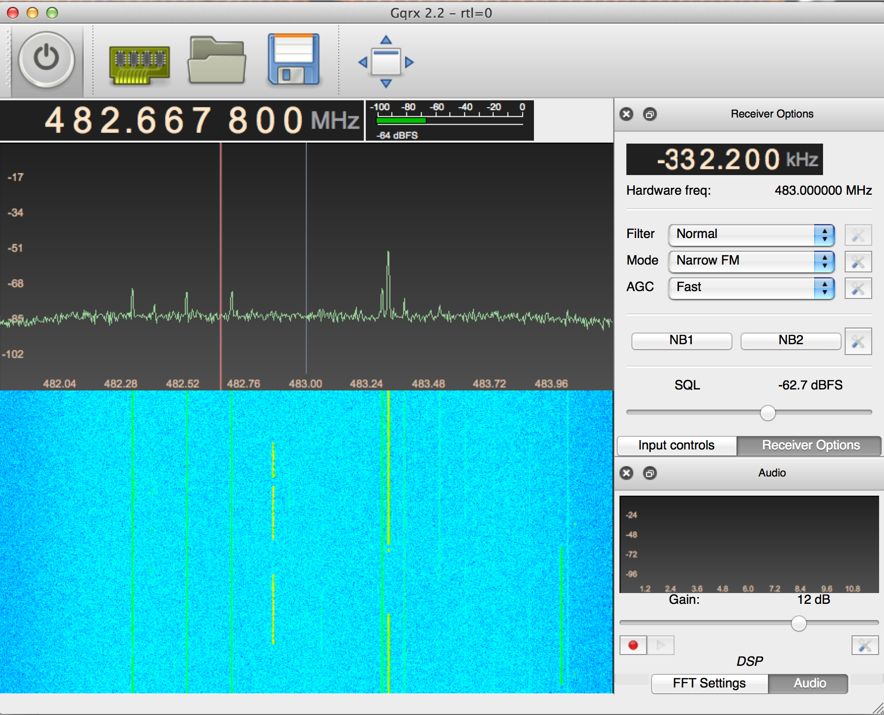  

Here the receiver frequency is 483 MHz, and the receiver offset is -332.2 KHz, so that we are receiving the frequency 482.667 800 MHz. The frequencies won't be exactly those shown in the table, because the crystal in your SDR drifts with as it warms up. We'll look at calibrating this out later in the class.

Another useful control is the squelch slider, labeled “SQL” on the “Receiver Controls”. Tune to a frequency that is only noise, and adjust the slider so that it just blanks the noise, and the speaker goes quiet. Then when you tune to an active frequency the signal will come through, but will blank again when the signal stops. This will annoy your roommates less!

There are lots of other frequencies where you can find narrow band FM signals. One is the police and fire band at about 154 MHz. Another are the amateur radio bands from 144-148 MHz, 220-225 MHz, and 420-450 MHz. There are many commercial users, like PG&E, right above 450 MHz. These fun to listen to after a power failure. Another is the weather radio around 162.500 MHz, where different weather stations are separated by 25 kHz spacings.

## Assignment

To show you have completed this lab, take a screen shot of some frequency band where you have found narrow band FM signals. Save it and a description of what it is as a PDF, and submit it to Gradescope. Use the radio reference (or google) to figure out who is using that frequency.

There are lots of other interesting frequency bands out there, that use other forms of modulation. Check out 463 MHz (lots of digital radio), 900-930 MHz (Paging, ISM), and Cell phones (700-800 MHz).
