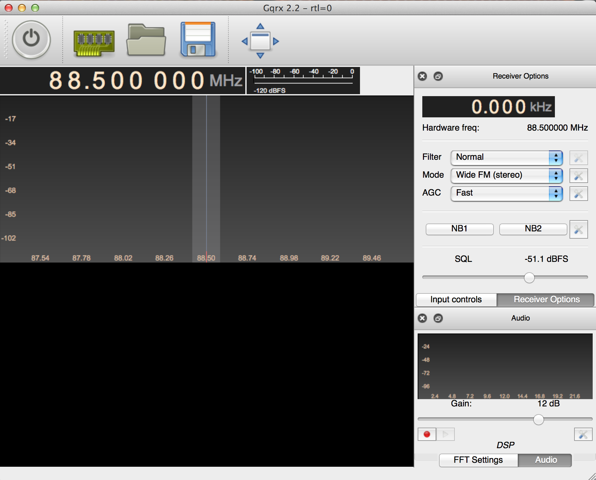
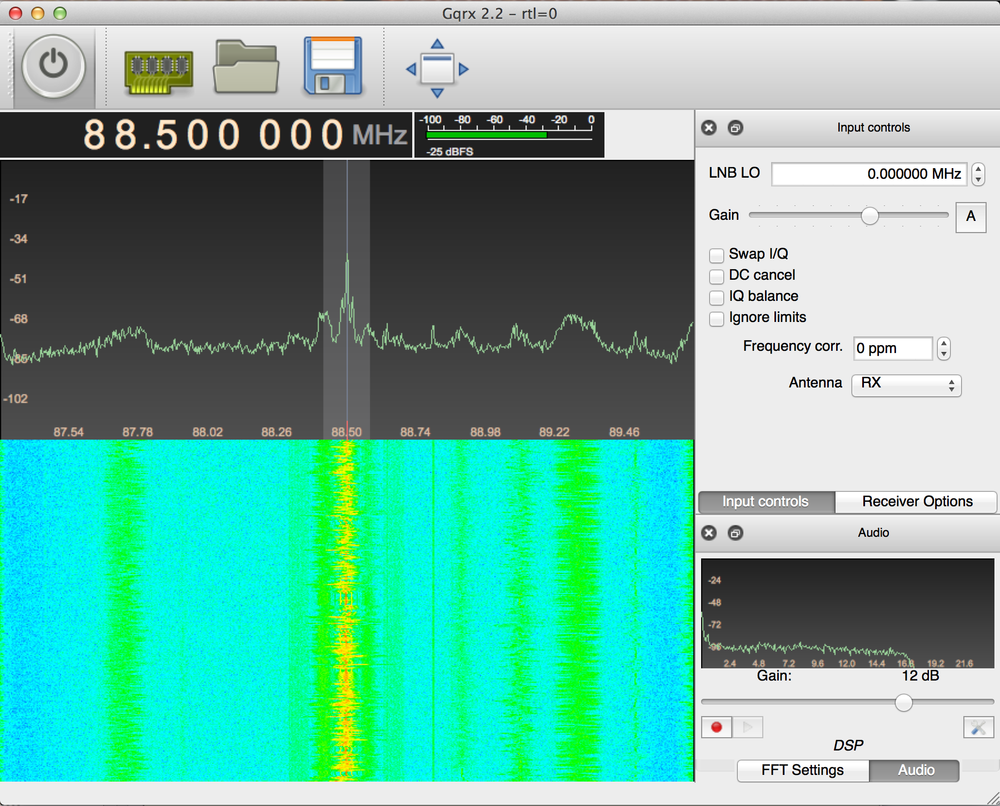
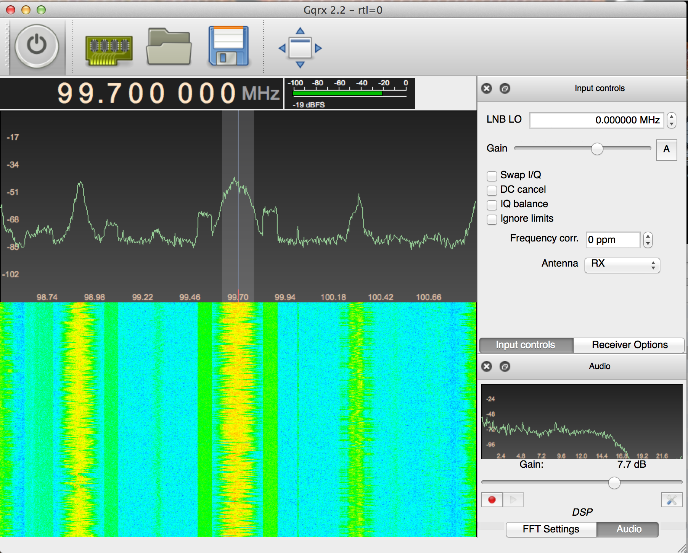
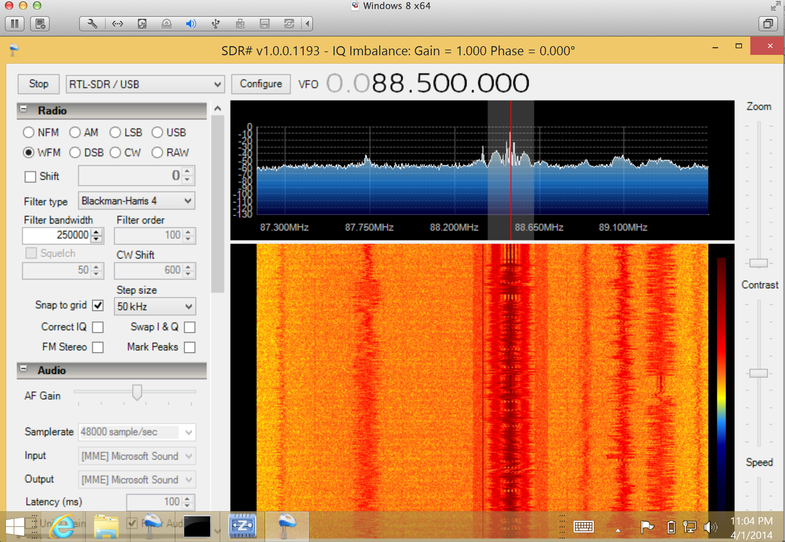

# Lab 1: Installing SDR Receivers
(Adapted from Dr. John Pauly's Stanford University EE179 course website: https://web.stanford.edu/class/ee179/Homework.html.)

## Overview

The USB dongles we passed out in class can directly digitize a 3.2 MHz segment of the RF spectrum, from 27 MHz up to 1.7 GHz. This can capture a large part of the RF spectrum, which we can then process in MATLAB or Python and extract the signals we want.

In this lab we will install the USB software for your computer and then use a real time spectral display to look at some of the different signals that are all around you.

## Aims of the Lab

This lab is aimed getting your software working and starting to look around at all of the signals that you are constantly being bombarded with. The main requirement of the lab is to take a screen shot of your display at the end of the lab and submit it to Gradescope.

This will show you have gotten everything going! Find an interesting frequency, and try to identify what is happening there. Next week there will be more to do.

## Software Installation

There are two parts to the software you need. The first is the device driver to control the SDR. The second is the spectrum visualization software. For mac users, you can download all of this in one package. For windows users, you need to download the drivers and the visualization software as a package, and then install them separately

**MacOS**

For MacOS, we will use the gqrx program. This is a graphical interface that is built on top of gnu radio, an open source software defined radio project. When you download gqrx, you will also get the gnu radio libraries, as well as the command line programs we will use in the next labs.

The gqrx web page is

[http://gqrx.dk](http://gqrx.dk/)

The latest stable version is 2.6. It requires MacOS 10.11 or newer. Click the download tab at the top of the page, and scroll down to the the MacOS link. If you are ambitious you can use macports to get latest version, but this requires more work.

Once the file has downloaded click on the .dmg file, and copy gqrx into your Applications folder.

**Windows**

For Windows we will use SDR#. This is the same sort of program as gqrx, but written in C# for Windows. The web page is

[http://airspy.com/download](http://airspy.com/download/)

SDR# used to be an amateur project that was taken over by Airspy, which makes higher end SDR's. Download the first package, that includes SDR# along with a number of other interesting and useful components. You also need to install drivers for windows, which is described here:

[rtl-sdr-quick-start-guide](http://www.rtl-sdr.com/rtl-sdr-quick-start-guide)

This worked for me pretty directly, so I wish you luck.

## Commercial FM Radio

First, plug the antenna into your sdr, and the sdr into a USB socket on your computer. Then, start your program. We'll look at gqrx here, but SDR# is very similar, and has the same settings to adjust.

When you start gqrx, it will pop up a window for the device configuration

Configuration Window

  

Set the sample rate to 2400000 (i.e. 2.4 MHz). Your computer and the sdr should keep up with this easily. After clicking OK, gqrx will pop up:

Initial Display

  

This is a previous version of gqrx, but it should look similar. Set the frequency offset in the upper right to 0.000 kHz, and then set the receiver frequency in the upper left to 97.700 000 MHz. This is KAFA, which is a nice clean signal. Change the “Mode” pulldown on the right side of the screen to “Wide FM (Stereo)”. The display should look like this:

Tuned to KAFA

  

Now click the big button in the upper left corner. It looks like an on/off power button. With any luck, you should be listening to KAFA!

Tuned to KAFA

  

The plot in the upper panel is the live spectrum that is being received, and has a range +/- 1.2 MHz, since you set the sampling rate to 2.4 MHz.

The lower panel is a waterfall plot. Each line in the image is the spectrum from the top panel, displayed with color encoding amplitude. It slowly scrolls down as you acquire longer. This plot is a great way to recognize different types of signals.

One useful setting is the receiver gain. To change this click on “Input Controls”, which will bring up a panel for controlling the SDR. The slider at the top adjusts the gain. If it is too low (to the left), the signal will be all noise. If it is too high (to the right) the receiver saturates, and the signal is distorted. The “A” button sets the gain automatically, which you generally don't want to do when you are looking for signals, since it will constantly be changing.

Go back to the “Receiver Options”. The top “Filter” pulldown sets how wide a bandwidth we are listening to. This is the shaded region on the live spectrum plot. On “Normal” it chooses something reasonable for whatever modulation we are receiving, so generally leave it there. The middle “Mode” pulldown selects how the receiver decodes the signal. Common choice are “AM”, used for aircraft and air traffic control, “Narrow FM” used for police and fire radio, and “Wide FM” used for commercial FM radio. We will talk about the other options later. The bottom “AGC” pulldown sets how rapidly the receiver adjusts for amplitude variations in the signal.

Try setting the center frequency to other stations that you may know (such as 92.9 out of Pueblo or 98.1 classic rock). Often you will see several stations in the plot, as shown below:

### Tuned to 99.7

  

Select any of them by clicking on them in the top panel. That will set the receiver offset.

The SDR# version looks like this, when tuned to KAFA:

### SDR# Tuned to KAFA

  

Choose “RTLSDR/USB” as the input, next to the stop/play button in the upper left. Aside from the color scale, one difference from gqrx is that the SDR gain and sampling rate is set by the “configure” button. Otherwise the controls are pretty much the same.

We will come back to commercial FM in a couple of labs.

## Police, Fire, and Amateur Radio

There are several frequency bands that are used for public services, such as local police and fire. For Palo Alto, the police, fire, and utilities frequencies are

and for the Stanford Police are

These are from

[http://radioreference.com](http://radioreference.com/)

which is a great source of information on who is transmitting what from where. Both the Palo Alto Police, and the Stanford Police are right around 483 MHz, so set your receiver frequency there. With your 2.4 MHz bandwidth you should see lots of activity, particularly later in the evening.

Note that you may need to find the right environment to be able to see lots of signals. Lots of devices spew RF. Campus buildings, like Packard, have a tremendous amount of interference. Also, buildings can screen signals. You may need to put your antenna in a window, or take your receiver outside, in order to improve your reception.

First, set your receive “Mode” pulldown to “Narrow FM”. This uses much less spectrum than commercial FM, and is commonly used for handheld communications such as police and fire. Click on any of the peaks in the upper plot. That will shift your receiver offset to that frequency. About half of the signals are digital, and will sound like dial-up modems. We'll talk about how these signals are encoded later in the class. The other half will be narrowband FM, and should be easy for you to decode. Your screen should look something like this

### Police and Fire Frequencies

  

Here the receiver frequency is 483 MHz, and the receiver offset is -332.2 KHz, so that we are receiving the frequency 482.667 800 MHz. The frequencies won't be exactly those shown in the table, because the crystal in your SDR drifts with as it warms up. We'll look at calibrating this out later in the class.

Another useful control is the squelch slider, labeled “SQL” on the “Receiver Controls”. Tune to a frequency that is only noise, and adjust the slider so that it just blanks the noise, and the speaker goes quiet. Then when you tune to an active frequency the signal will come through, but will blank again when the signal stops. This will annoy your roommates less!

There are lots of other frequencies where you can find narrow band FM signals. One is the police and fire band at about 154 MHz. Another are the amateur radio bands from 144-148 MHz, 220-225 MHz, and 420-450 MHz. There are many commercial users, like PG&E, right above 450 MHz. These fun to listen to after a power failure. Another is the weather radio around 162.500 MHz, where different weather stations are separated by 25 kHz spacings.

## Assignment

To show you have completed this lab, take a screen shot of some frequency band where you have found narrow band FM signals. Save it and a description of what it is as a PDF, and submit it to Gradescope. Use the radio reference (or google) to figure out who is using that frequency.

There are lots of other interesting frequency bands out there, that use other forms of modulation. Check out 463 MHz (lots of digital radio), 900-930 MHz (Paging, ISM), and Cell phones (700-800 MHz).
