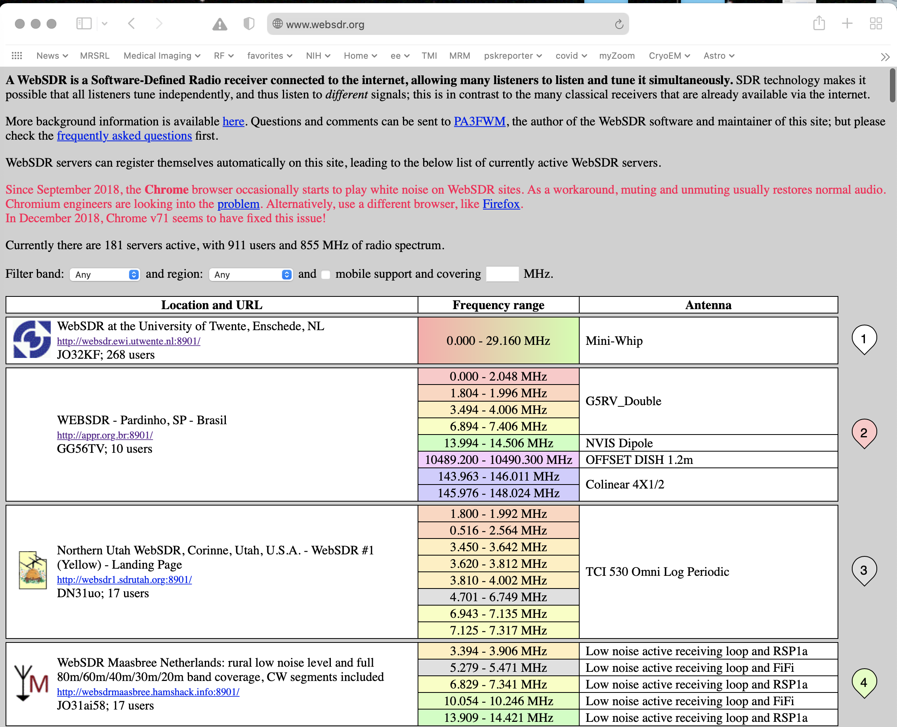
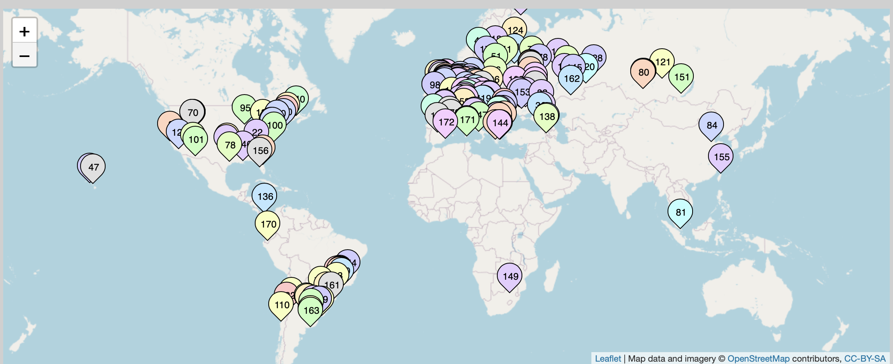
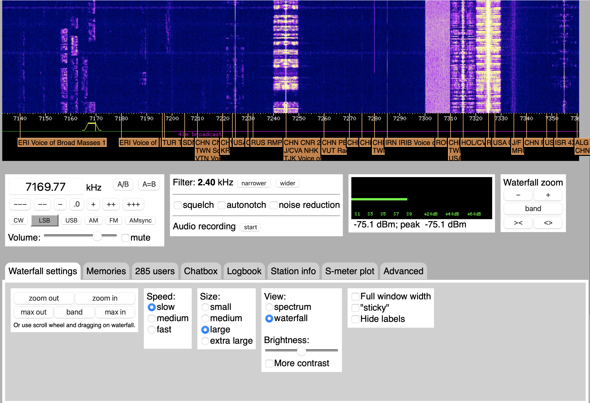
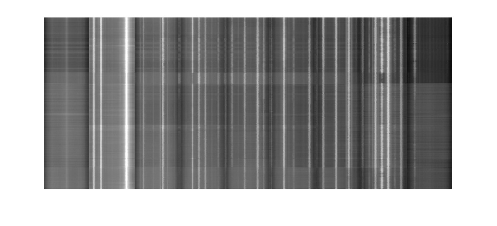
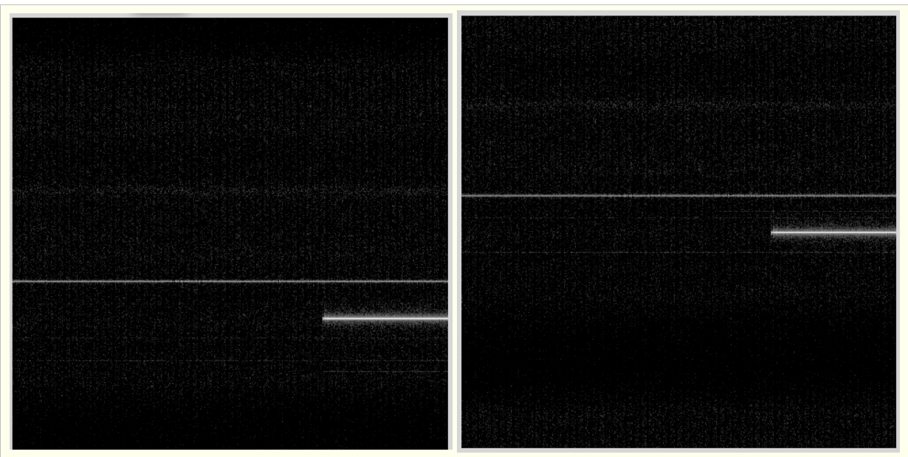
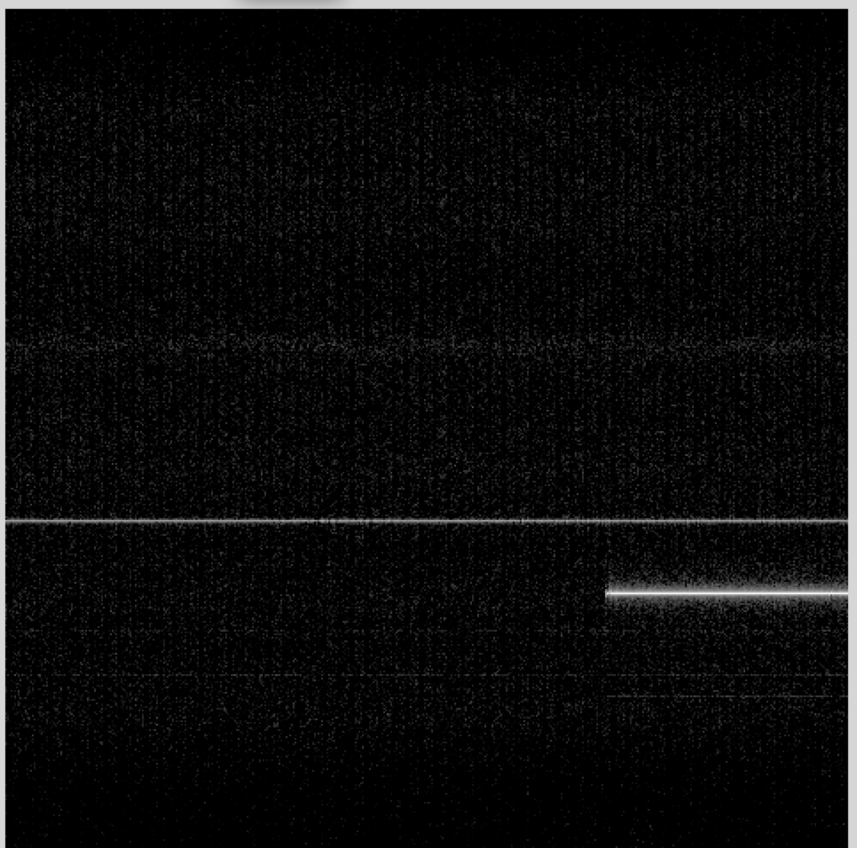
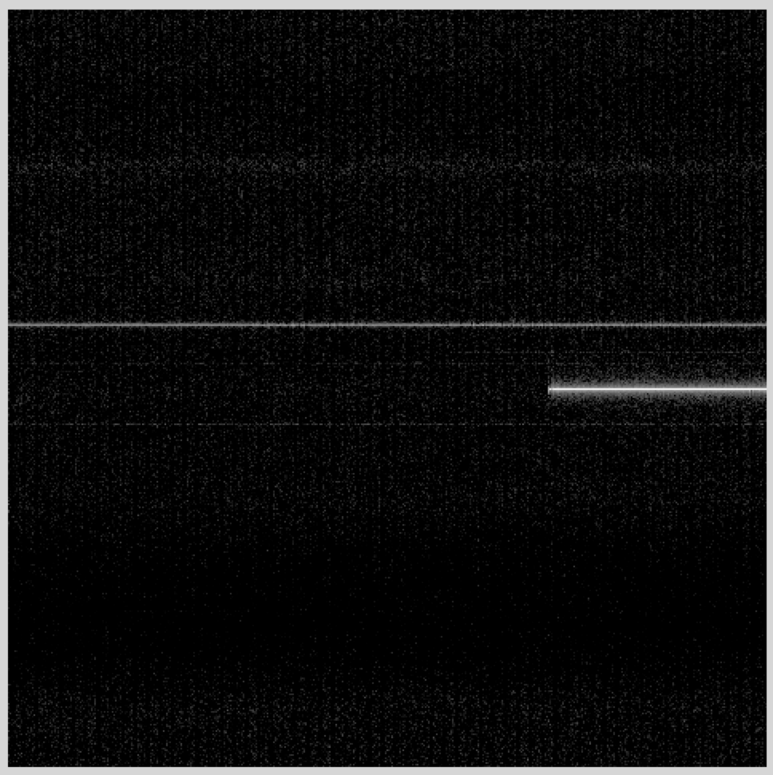
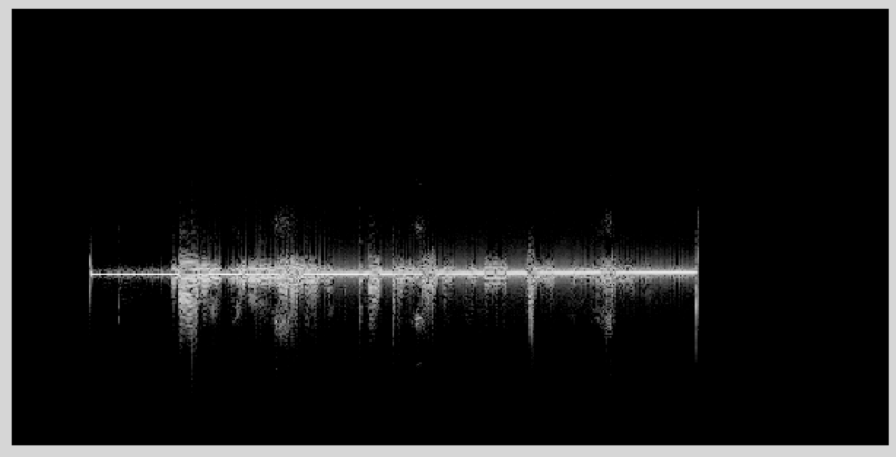
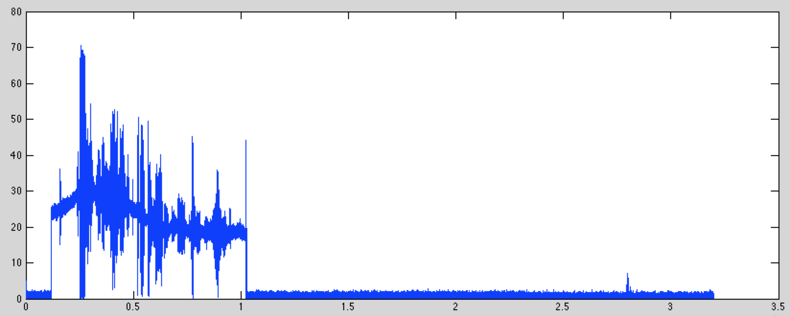

# Lab 3: Scanning for Signals, Modulation, and Decimation 
(Adapted from Dr. John Pauly's Stanford University EE179 course website: https://web.stanford.edu/class/ee179/Homework.html.)

## WebSDR Demo

We'll start with a demo of WebSDR's. These are SDR's, some just like yours, that are attached to the web. You can connect to them with a web browser, and control the frequency and demodulations just like it was attached to your own computer. This is nice in that you can listen to radio signals from all over the world, and many of the SDR's are attached to nice antennas in a wide range of frequency bands.

A web site that provides a list of WebSDRs is here

[WebSDR](http://www.websdr.org/)

The web page has a list of WebSDR's and which bands they can tune to



The second one is in Brasil, and covers most of the HF amateur bands, the VHF band, and more. The third one is in Utah, and covers the lower part of the HF band. If you scroll to the very bottom of the page you see a map where they are all located. You can click on any of them to listen to what they are receiving.



The first WebSDR in the lists is a very nice one from University of Twente in the Netherlands. This is a system that captures the entire spectrum from 0-30 MHz, and lets you tune in to any part of it. It picks up most of Europe. It is available here

[Twente WebSDR](http://websdr.ewi.utwente.nl:8901/)

The interface for the Websdr looks like this:



You can zoom in and out using your trackpad or mouse wheel, and shift the spectrum left and right by dragging with your mouse. You can also type in a center frequency.

In the example above you see a couple of different types of signals. There are a couple of AM shortwave signals, a digital shortwave signal, and several LSB SSB signals (it is 7 MHz, so it is lower sideband here). To listen to one of these you drag the filter icon under the waterfall plot to the signal you are interested in, and choose the right demodulator (in the box with the frequency and volume controls).

For your lab report, find an example of these signals

*   AM
    
*   SSB
    
*   Digital
    
*   Morse Code (check right above 7 MHz for this)
    
*   Something weird (radars, beacons, time, there is lots to find)
    

For each, include a screen shot, say what kind of signal it is, what frequency it is at, where it is from (use internet searches and/or GenAI to learn more about it!), and what time you acquired it.

## Broad Spectral Surveys with your RTL SDR

For the next part of the lab, we'll look at finding signals with your RTL SDR's. One of the issues with the RTL SDR's is that they only see 2 MHz of spectrum at a time. Some of the bands, like the TV and cell phone bands, are much broader than this, making it hard to appreciate what is going on. It is like trying to identify a picture while looking through a straw.

Fortunately, there is a command line utility for this, rtl\_power. What this does a explore an entire band of frequencies 2 MHz at a time. Then, you can splice them all together to get a more complete picture.

The help file for rtl\_power is (without the experimental options)

```
> rtl_power -h
rtl_power, a simple FFT logger for RTL2832 based DVB-T receivers

Use:	rtl_power -f freq_range [-options] [filename]
	-f lower:upper:bin_size [Hz]
	 (bin size is a maximum, smaller more convenient bins
	  will be used.  valid range 1Hz - 2.8MHz)
	[-i integration_interval (default: 10 seconds)]
	 (buggy if a full sweep takes longer than the interval)
	[-1 enables single-shot mode (default: off)]
	[-e exit_timer (default: off/0)]
	[-d device_index (default: 0)]
	[-g tuner_gain (default: automatic)]
	[-p ppm_error (default: 0)]
	filename (a '-' dumps samples to stdout)
	 (omitting the filename also uses stdout)

CSV FFT output columns:
	date, time, Hz low, Hz high, Hz step, samples, dbm, dbm, ...

Examples:
	rtl_power -f 88M:108M:125k fm_stations.csv
	 (creates 160 bins across the FM band,
	  individual stations should be visible)
	rtl_power -f 100M:1G:1M -i 5m -1 survey.csv
	 (a five minute low res scan of nearly everything)
	rtl_power -f ... -i 15m -1 log.csv
	 (integrate for 15 minutes and exit afterwards)
	rtl_power -f ... -e 1h | gzip > log.csv.gz
	 (collect data for one hour and compress it on the fly)

Convert CSV to a waterfall graphic with:
	 http://kmkeen.com/tmp/heatmap.py.txt
```


For example, to survey the entire FM band

```
> rtl_power -f 85M:110M:50k -g 20  fm_band.csv
```


This will periodically measure the power from 85 MHz to 110 MHz in steps of 50 kHz. This requires scanning 25 MHz / 2 MHz = 13 spectral segments (rounding up). Each segment has 2MHz /50kHz = 40 spectral bins. The total number of bins is then 520.

The -g switch sets the gain of the rtl_sdr. Use gqrx to find a reasonable gain, and make note of it. Then, enter this number after the -g switch on the command line. This seems to fail sometimes in Windows, in which case omit the -g switch completely, and let it autorange.

rtl_power tries to scan the entire band specified every ten seconds, so it can take a while to collect much data.

The output is a .csv file that gives the signal level in dBm for each bin. This is a massive amount of data. To load this into MATLAB, download this m-file

[HM.m](HM.m)

If you have a rtl\_power .csv file named fm_band.csv, you would load it into MATLAB with

```
>> d = HM('fm_band.csv');
>> mv = min(min(d));
>> imshow(d,[mv,0]);
```


The values are in dBm, and are all negative. Typically they range from -40 to 0. The function imshow() is in the image processing toolbox.



You can also use the heatmap.py routine available here (I didn't find it very helpful, but maybe you can figure out better Windows display options):

[heatmap.py](https://raw.githubusercontent.com/keenerd/rtl-sdr-misc/master/heatmap/heatmap.py)

On Windows, download heatmap.py into the same folder as fm_band.csv. Then open the command prompt or some other terminal, and input:

```
> cd C:\Users\YourName\Documents\FolderName
> python heatmap.py fm_band.csv fm_band.jpg
> start fm_band.jp
```

This will pop up an image of fm_band activity. There are many other display options available, especially for Windows.

Find an interesting band, and do a spectral survey with rtl\_power. Below is an example that scans from 400 MHz to 600 MHz. This was done over an hour.


FM is a good place to start because the signals are large. However, nothing much changes, the signals are always there. Some interesting options are the cell phone bands from 700 MHz to 900 MHz, the 902-928 MHz ISM band, or everything the rtl\_sdr can see from 50 MHz to 1700 MHz.

## Automatically finding signals in your captured data

Last week you found signals by looking at the spectrogram, which shows a time-frequency representation of the entire RF data you had captured. In the labs that are coming up, you will often need to be able to quickly and conveniently find where signals are in a large data set. One way to do this is a much more sparsely sampled version of the spectrogram.

The following m-file does this. It basically computes the same spectrogram as last week, but only for every 0.1s. It then finds which frequency channels have a signal over the “squelch” threshold, which defaults to 10% of the peak. It returns the frequency offsets of each signal it finds.

[ffreq.m](ffreq.m)

The file is shown below:

```
function [ f ] = ffreq( x, fs, fr, dt, sq )
%
%  f = ffreq(x, fs, fr, dt)
%
%   Find frequencies in an RF waveform x
%
%   Input:
%       x -- input RF waveform
%       fs -- sampling frequency
%       fr -- frequency resolution
%       dt -- time sampling period
%       sq -- threshold value
%
%   Output:
%       f -- frequencies found in signal
%

% assume reasonable defaults
if nargin < 5,
   sq = 0.1;
end
if nargin < 4,
   dt = 0.1;
end
if nargin < 3,
    fr = 1000;
end
if nargin < 2,
    fs = 2048000;
end

% find the frame size
nf = fs/fr;

% find the number of frames to skip
nt = fs*dt;

% compute the spectrum of the first block
xf = fftshift(fft(x(1:nf))).';

% compute the next blocks, spaced by dt seconds
jj = 1;
while jj< length(x)-nf,
    xf = [xf; fftshift(fft(x(jj+(0:nf-1)))).'];
    jj = jj+nt;
end

% find the maximum signals in each frequency bin
xfm = max(abs(xf));

% find the maximimum overall, for normalization
mx = max(xfm);

% find the indexes of the frequency channels that are abouve the
% squelch threshold.  Indexes are relative to the carrier
f = find(abs(xfm)>sq*mx) - nf/2;

% convert the indexes to absolute frequencies
f = f*fr;

end
```


If we load this data set (from Dr. Pauly)

[ab1355_10s.dat](ab1355_10s.dat)

 and then run ffreq.m with the default arguments (2048000 Hz sampling frequency, 1000 Hz frequency resolution, 0.1 s spacing between frames, and a 0.1 detection threshold), the result is

```
>> d = loadFile('ab1335_10s.dat');
>> f = ffreq(d)
f =

  Columns 1 through 8

     -998000     -402000     -401000     -400000     -399000     -398000     -397000     -396000

  Columns 9 through 11

     -395000     -394000     -224000
```


These are all frequencies in Hz, relative to the carrier frequency. There is a signal at -998 kHz, a band of frequencies centered at about -396 kHz, and another signal at -224 kHz.

What we want to do do is tune to each of these bands and listen to the signal. From class, we know that we need to demodulate first and then lowpass filter. In addition, we should reduce the sampling rate. The original RF waveform was sampled at 2.048 MHz, and we only need a few kHz accurately represent each of the channels.

Demodulation corresponds to multiplying by a complex exponential. If we start with the signal centered at -396 kHz, we can demodulate this frequency by

```
>> fs = 2048000 			% sampling frequency
>> dt = 1/fs    			% sampling time
>> t = [1:length(d)]*dt;  		% time of each of the samples of d
>> dm = d.*exp(-i*2*pi*(-396000)*t');	% d is the RF data loaded above, dm is is the demodulated data
```


If we compare the spectrogram of the first half second of signal before (left) and after (right):


<!-- <p float="left">
  
   
</p> -->

We see that the signal has been shifted to the middle of the spectrogram.

The next step is to reduce the sampling rate from 2.048 MHz to something more reasonable for an audio signal we can play through your sound card. The MATLAB function for that is “decimate”. This does two things. It lowpass filters the signal, and it reduces the sampling rate by some specified ratio.

We'll start by reducing the rate from 2.048 MHz to 16 kHz, or a factor of 64. While decimate will do this in one step, it is much more efficient to do this in two stages, each decimating by a factor of 8. The decimate function is efficient because it uses that fact that when you decimate by a factor of 8, then 7/8ths of the samples are going to be thrown away, and don't even need to be computed. We can decimate the demodulated dm signal with

```
>> dmd = decimate(dm,8,'fir');
>> dmdd = decimate(dmd, 8, 'fir');
```

The 'fir’ argument says to use a finite impulse response (FIR) filter for the lowpass filter prior to decimation. The default is to use a Chebychev infinite impulse response (IIR) filter, which is more efficient, but has non-linear phase. The FIR filter is a little slower to compute, but the linear phase response will be important when we are decoding digital signals later.

If we look at the spectrogram of the signal at this point what we see is



There are a couple of things to note. First, it is clear that the center frequency isn't exactly right. We can fix this with another complex demodulation. Second, we get a sense of the frequency content of the signal. It is contained in a much smaller bandwidth than our current sampling rate.

Because of the way the AM signal is constructed, we can detect the AM signal by taking the absolute value. Play back the signal with

```
>> sound(abs(dmdd), 32000);
```


If we plot the signal, we get



This shows that the audio signal has been added to an AM carrier. While the amplitude of the carrier changes with time, it doesn't affect your ability to decode the signal.

## Lab Report

1\. WebSDR: For your lab report, find and example of these signals

*   AM
    
*   SSB
    
*   Digital
    
*   Morse Code (check right above 7 MHz or 14 MHz for this)
    
*   Something weird (radars, beacons, time, there is lots to find)
    

For each, include a screen shot, say what kind of signal it is, what frequency it is at, where it is from (use internet searches and/or GenAI to learn more about it!), and what time you acquired it.

2\. RTL\_Power: Run rtl\_power on a band of interest to you, and include the resulting spectral survey image. What is in this band?

3\. AM Demodulation: For your lab report, follow the steps from this lab to demodulate/decimate your Airband signal from Lab 2. First, demodulate the signal ``d`` to center it exactly and save it as ``dm``. Then, decimate ``dm`` as shown in the lab. How much should you decimate the signal to optimize its sound quality? Include in your lab report a screen shot of the spectrogram of your result, along with your offset frequency, and decimation ratio of your final stage.

## Next Week

Next time we will look at narrow band FM modulation.